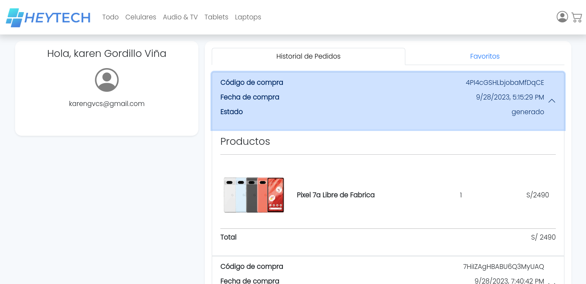

# HEYTECH

## Descripción

**HEYTECH** es una aplicación web en react de comercio electrónico que permite a los usuarios explorar, buscar y comprar productos en línea de manera conveniente. Con una interfaz de usuario intuitiva y atractiva, esta aplicación proporciona una experiencia de compra en línea fluida y segura.

## Características principales

- **Exploración de Productos**: Los usuarios pueden navegar y explorar una amplia variedad de productos organizados en categorías asi como tambien acceder a más detalles de un producto selecionado.
- **Carrito de Compras**: Los usuarios pueden agregar y eliminar productos del carrito de compras, así como ajustar las cantidades.
- **Proceso de Compra**: Al realizar el checkout de un pedido, este es creado y guardado para ir generando un historial de pedidos.
- **Lista de deseos**: Permite a un usuario con una cuenta creada guardar prodcutos en su lista de deseos.
- **Gestión de Cuenta**: Los usuarios pueden crear cuentas, ver el historial de pedidos y acceder a su lista de deseos.
- **Diseño Responsivo**: La aplicación es completamente receptiva y se adapta a dispositivos móviles y de escritorio.

## Capturas de pantalla





## Tecnologías Utilizadas

- React.js para la interfaz de usuario.
- Firebase para la autenticación, la base de datos en tiempo real y almacenamiento.
- Formik y yup para la validación de los formularios.
- Bootstrap y react Bootstrap para el diseño y componentes visuales.
- Netlify para desplegar el proyecto.

## Instalación

Para configurar el proyecto en tu entorno local, sigue estos pasos:

1. Clona este repositorio.
   ```
   git clone https://github.com/EdHuayllasco/PreEntrega2HuayllascoCarlos.git
   ```
2. Instala las dependencias
   ```
   npm install
   ```
   or
   ```
   yarn add
   ```
3. Inicia el servidor y la aplicación cliente.
   ```
   npm run dev
   ```
   or
   ```
   yarn dev
   ```

## Link del proyecto

[Heytech](https://65179d2cc575e3608fa46a80--courageous-griffin-98744a.netlify.app/)

### Credenciales para cuenta de prueba

```
   email: sofi@gmail.com
   password: 12345678
```
